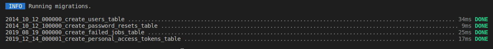
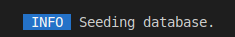

## Prerequisite
You need docker and WSL2 (only for windows ) to run the project.
<div align="center">

[](https://www.docker.com/)

</div>

---
## Installation & Configuration
Before starting the project, you must copy first the .env.example file by renaming it to .env and complete the following fields:

- DB_DATABASE
- DB_USERNAME
- DB_PASSWORD

```bash
cp .env.example .env
```
If it's the first time you launch the project, you must type:

```bash
docker run --rm \
    -u "$(id -u):$(id -g)" \
    -v $(pwd):/var/www/html \
    -w /var/www/html \
    laravelsail/php81-composer:latest \
    composer install --ignore-platform-reqs
```
After this, you can see a new folder call **Vendor**.

## Using Laravel Sail 

**Laravel Sail** is a light-weight command-line interface for interacting with Laravel's default Docker development environment.

By default, Sail commands are invoked using the vendor/bin/sail script that is included with all new Laravel applications:

`./vendor/bin/sail up`

However, instead of repeatedly typing vendor/bin/sail to execute Sail commands, you may wish to configure a shell alias that allows you to execute Sail's commands more easily:

`alias sail='[ -f sail ] && sh sail || sh vendor/bin/sail'`

To make sure this is always available, you may add this to your shell configuration file in your home directory, such as `~/.zshrc` or `~/.bashrc`, and then restart your shell.

Once the shell alias has been configured, you may execute Sail commands by simply typing `sail.` 

## Start the application

You can launch all the container with the following command in your terminal:
```bash
sail up -d
```
<div align="center">


</div>

## Installation of all dependencies
In your terminal, type : 
```bash
sail npm install 
sail npm run build
```

## Generate the key
In your terminal, type : 
```bash
sail artisan key:generate
```
<div align="center">


</div>


## Perform migrations and generate the dataset

In your terminal, type : 
```bash
sail artisan migrate
```
<div align="center">



</div>

```bash
sail artisan db:seed
```
<div align="center">



</div>

<br/>

**Congratulation, you are ready to work !**  🎉

---
## Exiting from the container

In your terminal, type : 
```bash
sail down
```
<div align="center">


</div>